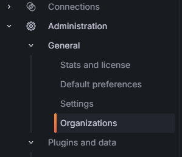

# Setup Grafana

The goal is to setup two new organisations, 

- Organization-A only data from tenant-a
- Organization-B only data from tenant-b
- The existing main org should be able to see data from tenant-a and tenant-b 

**1. Create organisations**

- Organization-A
- Organisation-B
- Keep the Main org.

**2. The organizations can be asigned to users via the usermanagement**

At the top of the screen you can navinate to the organizations you are authorized to

**3. Switch to Organization-A** and navigate to connection datasources and select Loki
- URL --> http://loki:3100
- HTTP headers (Header: X-Scope-OrgID value:tenant-a)
- save and test connection
**4 repeat** for Organisation-B (Header: X-Scope-OrgID value: tenant-b)

**5. Test using explore**
- {tenant="tenant-a"}
- {tenant="tenant-b"}

